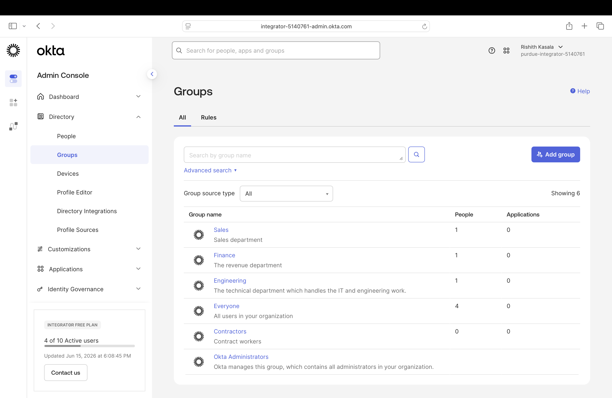
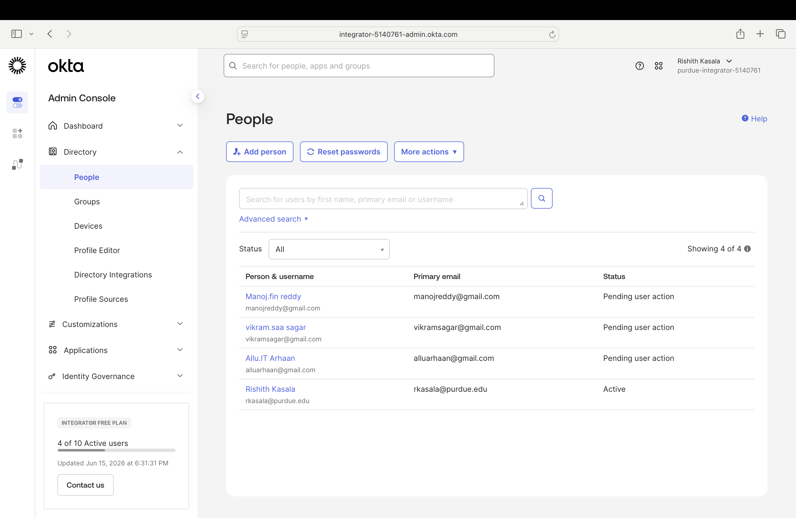

# Phase 1: Foundation Setup

# Objective
Establish the baseline directory structure: department groups and 
initial test users representing real-world workforce segments.

# What was built
- 4 department groups created in Okta:
  - Engineering — technical / IT staff
  - Sales — revenue-generating staff
  - Finance — financial operations
  - Contractors — non-FTE access pattern (lifecycle differs from FTE)
- 3 test users provisioned manually, one per primary department group

 # Design decisions
- Department groups chosen as the primary access boundary (vs. role-based 
  at this layer) because most enterprise environments structure entitlements 
  by department first, with role-based refinement layered on top.
- Contractors split into its own group rather than treated as a Sales/Eng 
  subset because contractor lifecycle (shorter tenure, faster offboarding, 
  restricted entitlements) is materially different from FTE.

 # Screenshots

# What's next
Phase 2: Build a mock HR source (CSV) and connect it for automated 
provisioning via Okta's import/SCIM capabilities.
